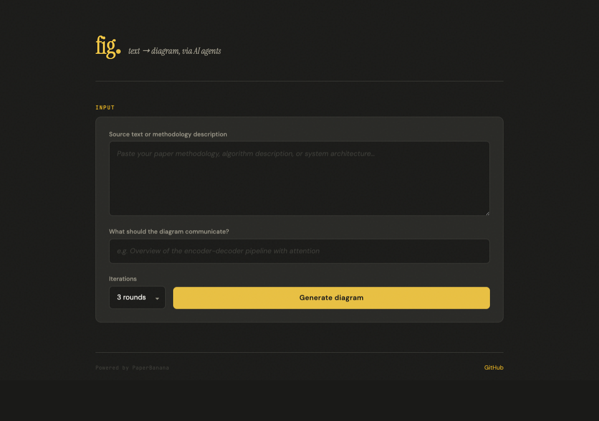

# 🍌 Banana Paper UI

**Text-to-diagram generation powered by multi-agent AI** — paste your methodology text, get a publication-quality diagram.

> **Derived from:** [llmsresearch/paperbanana](https://github.com/llmsresearch/paperbanana) — an unofficial open-source implementation of *"PaperBanana: Automating Academic Illustration for AI Scientists"* ([arXiv:2601.23265](https://arxiv.org/abs/2601.23265)).

---

## What We Added

This fork extends the original PaperBanana with:

- **Web UI** — A FastAPI-based web app with real-time agent progress tracking, so you can watch the 5-agent pipeline (Retriever → Planner → Stylist → Visualizer → Critic) work through your diagram step by step
- **OpenRouter provider support** — Use models beyond Google Gemini (Claude, GPT, etc.) for the VLM agents, and route image generation through OpenRouter
- **Dark editorial frontend** — Charcoal + banana yellow design with live progress indicators, shimmer animations, iteration thumbnails, and grain texture overlay

The CLI, Python API, MCP server, and evaluation tools from the original project are fully preserved.

<p align="center">
  
</p>

## How It Works

PaperBanana uses a two-phase multi-agent pipeline with 5 specialized agents:

**Phase 1 — Planning:**
1. **Retriever** — selects relevant reference diagrams from a curated set
2. **Planner** — generates a detailed textual description via in-context learning
3. **Stylist** — refines the description for visual aesthetics (color, layout, typography)

**Phase 2 — Iterative Refinement (3 rounds):**
4. **Visualizer** — renders the description into an image
5. **Critic** — evaluates and provides revision notes
6. Steps 4–5 repeat for up to 3 iterations

## Quick Start

### Prerequisites

- Python 3.10+
- An API key: either [Google Gemini](https://makersuite.google.com/app/apikey) (free) or [OpenRouter](https://openrouter.ai/keys)

### Install

```bash
git clone https://github.com/tech-grandpa/banana-paper-ui.git
cd banana-paper-ui
pip install -e ".[google]"
```

### Configure

```bash
cp .env.example .env
# Edit .env — add your API key(s) and choose providers
```

See `.env.example` for all options including OpenRouter configuration.

### Run the Web UI

```bash
cd webapp
uvicorn main:app --host 0.0.0.0 --port 8765
```

Open `http://localhost:8765` — paste your methodology text, add a caption, and hit generate.

### CLI Usage

```bash
# Generate a methodology diagram
paperbanana generate \
  --input method.txt \
  --caption "Overview of our framework"

# Generate a plot from data
paperbanana plot \
  --data results.csv \
  --intent "Bar chart comparing model accuracy"

# Evaluate a generated diagram
paperbanana evaluate \
  --generated diagram.png \
  --reference human_diagram.png \
  --context method.txt \
  --caption "Overview of our framework"
```

### Provider Configuration

**Google Gemini (default):**
```bash
GOOGLE_API_KEY=your-key
```

**OpenRouter (alternative models):**
```bash
OPENROUTER_API_KEY=your-key
VLM_PROVIDER=openrouter
VLM_MODEL=anthropic/claude-sonnet-4-20250514
IMAGE_PROVIDER=openrouter_imagen
IMAGE_MODEL=google/gemini-3-pro-image-preview
```

## Project Structure

```
├── paperbanana/       # Core library — agents, providers, pipeline
├── webapp/            # FastAPI web UI
├── prompts/           # Prompt templates for all 5 agents
├── data/              # Reference diagrams and style guidelines
├── configs/           # YAML configuration
├── mcp_server/        # MCP server for IDE integration
├── examples/          # Sample inputs and scripts
└── tests/             # Test suite
```

## Citation

If you use this work, please cite the **original paper**:

```bibtex
@article{zhu2026paperbanana,
  title={PaperBanana: Automating Academic Illustration for AI Scientists},
  author={Zhu, Dawei and Meng, Rui and Song, Yale and Wei, Xiyu
          and Li, Sujian and Pfister, Tomas and Yoon, Jinsung},
  journal={arXiv preprint arXiv:2601.23265},
  year={2026}
}
```

## License

MIT — see [LICENSE](LICENSE).

---

*Original project: [llmsresearch/paperbanana](https://github.com/llmsresearch/paperbanana) · Original paper: [arXiv:2601.23265](https://arxiv.org/abs/2601.23265)*
